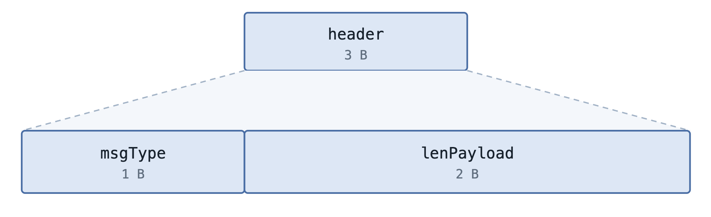
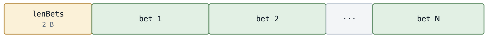
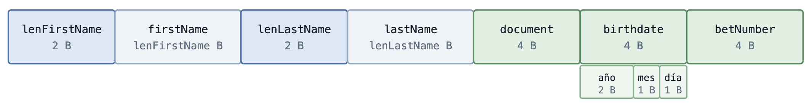
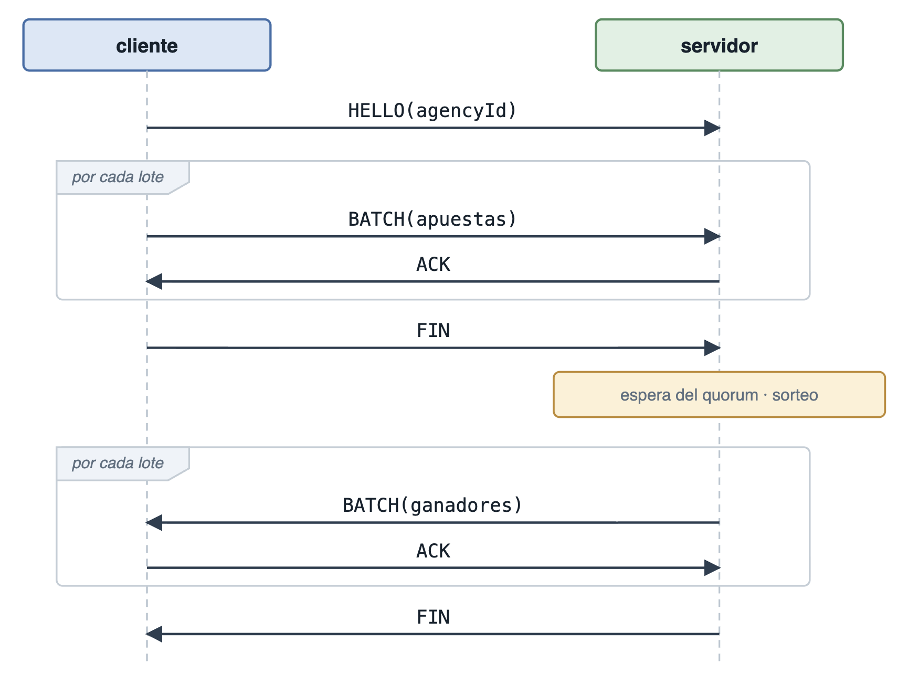
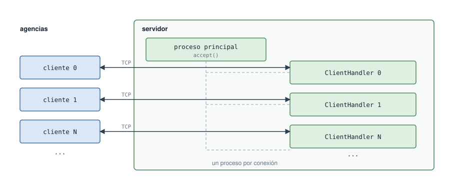

# TP Nivelador: Docker, Comunicaciones y Concurrencia

**Sistemas Distribuidos I — Cátedra Roca**

## Índice

- [Introducción](#introducción)
- [Protocolo de comunicación](#protocolo-de-comunicación)
  - [Formato del frame](#formato-del-frame)
  - [Payload de un batch](#payload-de-un-batch)
  - [Diagrama de secuencia](#diagrama-de-secuencia)
- [Concurrencia y sincronización](#concurrencia-y-sincronización)
  - [Roles](#roles)
  - [Manejo de la concurrencia](#manejo-de-la-concurrencia)
    - [El storage: exclusión mutua](#el-storage-exclusión-mutua)
    - [El quorum: barrera](#el-quorum-barrera)
- [Cierre ordenado](#cierre-ordenado)
  - [Servidor](#servidor)
  - [Cliente](#cliente)
- [Configuración](#configuración)
- [Ejecución](#ejecución)

## Introducción

El sistema modela una lotería nacional: seis agencias, implementadas como
clientes en Go, cargan las apuestas de sus participantes contra una central
implementada como servidor en Python. La central las persiste, realiza el
sorteo cuando se alcanza un mínimo de agencias, y le devuelve a cada una
únicamente sus propios ganadores.

A continuación se detallan las decisiones más relevantes de la solución. La
primera parte describe el protocolo de comunicación diseñado sobre sockets TCP:
el formato de los mensajes y el intercambio entre las partes. La segunda cubre el modelo de
concurrencia del servidor y los mecanismos usados para sincronizar el acceso al
almacenamiento y la espera del quorum. La última explica cómo terminan ambos
procesos de forma ordenada al recibir una señal de terminación.

## Protocolo de comunicación

Clientes y servidor se comunican por sockets TCP. TCP entrega un flujo continuo
de bytes: garantiza que lleguen todos y en orden, pero no marca dónde termina un
mensaje y dónde empieza el siguiente. Un mismo envío puede llegar partido en varias
lecturas, o dos envíos pueden llegar juntos en una sola.

Por eso el protocolo define su propio *framing*. Cada mensaje se transmite
precedido por un encabezado de tamaño fijo que declara qué tipo de mensaje es y
cuántos bytes de contenido trae, de modo que el receptor siempre sabe hasta
dónde leer.

### Formato del frame

Todo mensaje consta de un header y un payload. El header son 3 bytes y el payload es variable.


Dentro del header hay dos campos: el `msgType`, que indica el tipo de mensaje, y
el `lenPayload`, que indica cuántos bytes de payload vienen a continuación.



Que la longitud esté en el header permite leer un frame completo con dos
llamadas al socket, los 3 bytes fijos, y después exactamente los bytes que el
header anuncia. Y así parsear el contenido en memoria, sin volver al socket campo
por campo.

Los tipos de mensaje son cuatro:

| valor | nombre | dirección | payload |
|-------|--------|-----------|---------|
| `0x00` | `MSG_BATCH` | ambas | lote de apuestas o de ganadores |
| `0x01` | `MSG_FIN` | ambas | vacío |
| `0x02` | `MSG_ACK` | ambas | vacío |
| `0x03` | `MSG_HELLO` | cliente → servidor | `agencyId 1B` |

`MSG_FIN` y `MSG_ACK` no llevan payload: su frame es exactamente el header, con
`lenPayload` en cero. Por eso todos los mensajes se leen de la misma forma: el
header siempre mide lo mismo y él mismo indica cuánto falta leer, sin necesidad
de saber de antemano qué tipo de mensaje viene.

`MSG_HELLO` lleva un solo byte de payload: el número de agencia. Se envía una
única vez, al abrir la conexión, en lugar de repetirlo en cada apuesta. La
agencia es una propiedad de la conexión y no cambia mientras dura, así que
declararla por registro sería repetir un dato invariante.

### Payload de un batch

El payload de un `MSG_BATCH` arranca con la cantidad de apuestas y sigue con las
apuestas concatenadas.



Cada apuesta es autodelimitada: los dos campos de largo variable (nombre y
apellido) van precedidos por su longitud, y el resto son campos de tamaño fijo.
Por eso el lote se recorre sin necesidad de separadores.



Todos los enteros van en big endian. Los largos de string son en **bytes**
(codificación UTF-8).

### Diagrama de secuencia



El ciclo de vida de una conexión es el siguiente:

1. **Identificación.** El cliente abre la conexión y envía `HELLO` con su número
   de agencia. A partir de ahí el servidor sabe a quién está atendiendo.
2. **Carga.** El cliente lee su archivo de entrada y envía las apuestas en lotes
   de `BATCH_SIZE`. El servidor persiste cada lote y solo entonces responde
   `ACK`; el cliente no envía el siguiente hasta recibirlo.
3. **Fin de carga.** Agotado el archivo, el cliente envía `FIN` y queda a la
   espera.
4. **Quorum.** El proceso que atiende a esa agencia se bloquea hasta que se
   junten `AGENCY_QUORUM_MIN` agencias que hayan terminado de cargar.
5. **Sorteo.** Alcanzado el quorum, el servidor recorre el storage, filtra los
   ganadores de esa agencia y se los envía en lotes, cada uno confirmado por el
   cliente con un `ACK`.
6. **Cierre.** El servidor envía `FIN`, el cliente termina de persistir su
   archivo de salida y ambos cierran la conexión.

   
## Concurrencia y sincronización




El servidor atiende a cada agencia con un proceso dedicado: por cada conexión
que acepta lanza un `multiprocessing.Process`, así que hay tantos procesos hijos
como clientes conectados.

Descartado `asyncio` por el enunciado, la decisión real fue entre procesos y
threads. La carga es mayormente de I/O y en esos tramos el GIL se libera, así
que con `threading` también habría funcionado. Se eligieron procesos porque la
parte que no es I/O —deserializar los lotes— no libera el GIL: con threads las
agencias se turnarían para ejecutarla, mientras que con procesos se puede
paralelizar realmente esta parte.

### Roles

**Proceso principal** (`Server.py`): Solo acepta conexiones y delega. Por cada cliente que
llega lanza un proceso hijo, le entrega el socket y vuelve al `accept`. No habla
el protocolo. Al recibir la señal de terminación destraba a los hijos y los
espera.

**Proceso por cliente** (`ClientHandler.py`): Atiende a una agencia de principio a
fin: recibe el `HELLO`, persiste sus lotes confirmando cada uno, espera el
quorum, sortea filtrando por su agencia y le devuelve sus ganadores. Esta sí habla el protocolo.

### Manejo de la concurrencia

Los procesos hijos comparten exactamente dos cosas, y cada una necesita su
propio mecanismo: el archivo donde se persisten las apuestas, y el momento en
que puede realizarse el sorteo.

Los dos se crean en el proceso principal antes de aceptar la primera
conexión: tienen que existir previamente a cualquier `fork` para que los hijos
los hereden.

#### El storage: exclusión mutua

Todas las agencias escriben y leen el mismo CSV. Tanto `store_bets` como
`load_bets` se ejecutan dentro de un `multiprocessing.Lock`, de modo que un solo
proceso a la vez toque el archivo.


#### El quorum: barrera

Se usa `multiprocessing.Barrier(AGENCY_QUORUM_MIN)`. Cada proceso, tras recibir
el `FIN` de su cliente, llama a `wait()` y queda bloqueado hasta que se junten
las agencias necesarias; recién entonces sortea.


La barrera cuenta y bloquea en una sola operación atómica, así que no hace falta un contador compartido ni un lock que lo proteja. Es la primitiva que corresponde al requisito: esperar a que lleguen N participantes. 

Como contrapartida, `Barrier` es cíclica: si el total de agencias no es múltiplo
del quorum, las sobrantes quedan esperando a un grupo que nunca se completa. Se
asume entonces que la cantidad de agencias es múltiplo del quorum. Según lo
aclarado por la cátedra, que una agencia sobrante espere a que
lleguen otras es un comportamiento válido.


## Cierre ordenado

Al recibir SIGTERM, ambos procesos terminan liberando lo que tomaron en lugar de
morir a la fuerza. El principio es el mismo en los dos lenguajes: el handler
de la señal solo destraba; la limpieza ocurre en el flujo normal.

### Servidor

Cuando llega la señal al proceso principal:

1. Deja de aceptar conexiones nuevas.
2. Destraba a los hijos que están esperando el sorteo.
3. Les avisa de cerrar a los que están esperando apuestas.
4. Espera a que todos hayan terminado, y recién ahí finaliza.

Los primeros dos pasos son el handler, que cierra el socket de escucha —lo que
hace fallar al `accept()`— y aborta la barrera:

```python
def _shutdown(self, signum, frame):
    self.running = False
    self.server_socket.close()   # destraba el accept()
    self.quorum.abort()          # destraba a los que esperan el sorteo
```

Los dos pasos restantes ocurren fuera del handler, una vez que el `accept()`
falló y el bucle principal terminó:

```python
def _close(self):
    for process in self.children:
        process.terminate()
    for process in self.children:
        process.join()
```

El `terminate()` dispara el handler del hijo, que le cierra el socket del
cliente. Con eso quedan cubiertos los dos únicos lugares donde un hijo puede
estar bloqueado: la barrera y la recepción de apuestas.

El aviso y la espera se hacen en dos recorridos separados. Si se le avisara y se
lo esperara de a uno, los cierres se encadenarían en vez de solaparse.

### Cliente

En Go las señales no interrumpen la ejecución: el runtime las entrega como
valores en un canal. Hay entonces una goroutine dedicada a esperarlas, y cuando
llega SIGTERM hace dos cosas:

1. Cierra el socket, lo que destraba la lectura o escritura en curso.
2. Pone el estado `running` en false, para distinguir el cierre pedido de una
   falla.

El `Read` o `Write` bloqueado devuelve error, ese error propaga hacia arriba, y
al retornar se ejecutan los `defer` que cierran los archivos.

El estado `running` hace falta porque, visto desde adentro, un socket cerrado a
propósito es indistinguible de uno que se cayó. `Run()` lo consulta para decidir
con qué código termina el proceso:

```go
func (client *Client) Close() error {
    client.running.Store(false)
    return client.proto.Close()
}

func (client *Client) Run() error {
    err := client.run()
    if err != nil && !client.running.Load() {
        return nil // el error viene del cierre pedido, no de una falla
    }
    return err
}

go func() {
    <-sigs
    client.Close()
}()
```

Distinguir un cierre pedido de una falla real requiere que la goroutine de la
señal le comunique algo al hilo principal. Ese flag es estado compartido entre
dos flujos concurrentes, y por eso es un `atomic.Bool`.

## Configuración

| variable | usa | default |
|---|---|---|
| `SERVER_HOST`, `SERVER_PORT` | ambos | requerida |
| `SERVER_STORAGE` | servidor | `/tmp/bets.csv` |
| `AGENCY_QUORUM_MIN` | servidor | `1` |
| `AGENCY_ID`, `INPUT_FILE`, `OUTPUT_FILE` | cliente | requerida |
| `BATCH_SIZE` | cliente | requerida |

`SERVER_STORAGE` y `AGENCY_QUORUM_MIN` tienen valor por defecto porque no todos
los archivos de compose las definen, y el servidor debe poder levantar igual.

El resto de los valores ajustables no se configuran por entorno, porque no
cambian entre ejecuciones, pero están declarados como constantes con nombre en
lugar de aparecer sueltos en el código.

Uno de ellos merece una aclaración. `WINNERS_BATCH_SIZE`, definida en
`client_handler.py` con valor 32, es el análogo del `BATCH_SIZE` del cliente
pero para el sentido inverso: agrupa los ganadores que el servidor devuelve. El enunciado no
pide que la respuesta vaya en lotes pero se implementó igual, por dos motivos: mantiene
simétrico el manejo de los dos sentidos, y evita que la respuesta dependa de
cuántos ganadores haya, ya que un payload no puede exceder los 65 535 bytes.

Por eso mismo se dejó como constante y no como variable de entorno. Con el valor
elegido, en la práctica los ganadores de una agencia entran todos en un único
lote.

## Ejecución

```bash
make up      # construye e inicia los containers
make logs    # sigue los logs
make down    # detiene y libera recursos
make test    # corre las pruebas de caja negra
```
